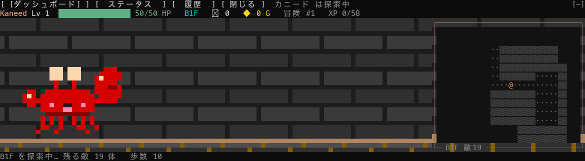
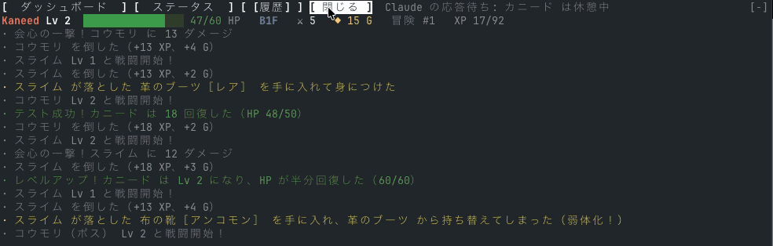
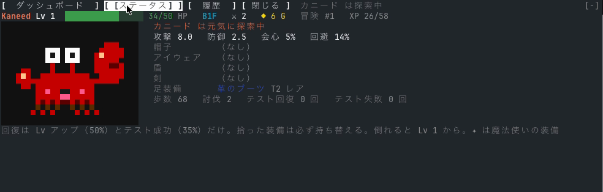
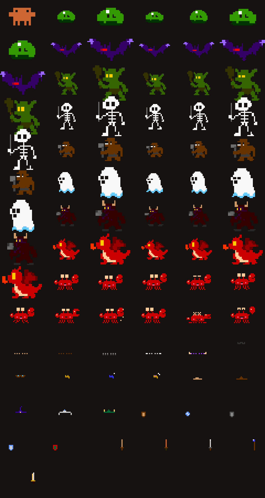

# kaneed-dungeon

Claude が考えている間、カニード がプロンプトの上でダンジョンを探索し続ける **Claude Mod**（function hooks プラグイン）。

- カニード はモデルのターンが走っている間だけ歩き、Claude が応答を待っている間は休憩する（HP は回復しない）。
- **回復手段は 2 つだけ**。レベルアップ（最大 HP の 50%）と、Claude が実行したテストの成功（35%）。
- **倒れると Lv 1・装備なし・B1F からやり直し**。それまでの冒険は「これまでの冒険」に記録される。
- 装備は 5 部位（帽子・アイウェア・盾・剣・足装備）× 5 段階 × 5 レア度。**拾った装備は必ず持ち替える**ので、良い装備を捨ててしまうこともある。各部位に魔法使い風の装備が 1 種類ある（✦ 印）。
- レベルは無限。ダンジョン生成時の敵の強さは カニード のレベルに追従し、階を下るごとに少しずつ上回ってくる。
- マップはセッション開始時に生成され、コンテキスト圧縮（compaction）が起きると同じ階が組み替わる。90×46 マスの階を探索し尽くすと階段で次の階へ。
- **横スクロールのアクション画面**。左に カニード、右から敵・宝箱・階段が現れる。攻撃は FF 風に前へ踏み込み、ヒットで敵が光ってダメージ数字が浮かぶ。右上にその階の周辺マップ。
- ユーザーができるのは表示の切り替えだけ（ゲーム画面 / ダッシュボード / ステータス / 履歴）。カニード の操作はできない。
- **ダッシュボード**では、このセッションで Claude が何にトークンを使ったか（種類の内訳・キャッシュの効き・重かったターン・コスト・コンテキストの中身・利用上限）と、プラグインが受け取ったイベント、カニード の記録を見られる。
- トークンは一切消費しない。すべてプラグイン内の TypeScript が処理する。



| ボス戦 | ステータス画面（`/kaneed status`） |
|---|---|
|  |  |

## 主人公を自作して遊ぶ

主人公は差し替え前提で作ってある。24×16 のドット絵を 1 枚描いて置くだけで、既存の装備 25 枚（帽子・アイウェア・盾・剣・足装備 × 5 段階）がそのまま乗る。

1. `tools/sprites/hero/idle_0.png`（24×16、RGBA 透過、足元を 14 行目に揃える）を描く。色は自由（描くときに 256 色へ丸められる）。
2. `tools/sprites/hero/anchors.json` に主人公の 5 点を書く。装備はこの点に合わせて乗る。

   ```json
   {
     "slots": {"hat": "hat", "eyewear": "eyes", "shield": "hand_l", "sword": "hand_r", "boots": "feet"},
     "default": {"hat": [10, 5], "eyes": [10, 2], "hand_l": [2, 7], "hand_r": [22, 7], "feet": [10, 12]},
     "frames": {}
   }
   ```

   `hat` は頭の上、`eyes` は両目の中間、`hand_l` / `hand_r` は左右の手、`feet` は足元。座標は画像の左上が (0, 0)。
3. 生成して再起動する。

   ```sh
   python3 tools/sprites/make_sprites.py hooks/boards/sprites.ts
   ```

コマ絵を増やすと動きが付く: `idle_1`（呼吸）、`idle_glance`（チラ見）、`idle_blink`（まばたき）、`walk_0` / `walk_1`（歩行）、`attack_0` / `attack_1`（踏み込み）、`hurt`（被弾）、`dead`（死亡）、`victory`（勝利）。無いコマは `idle_0` で代用される。コマで体が動くなら `anchors.json` の `frames` にそのコマの点を上書きで書く（例: `"idle_1": {"hat": [10, 6]}`）。目の間隔が違う絵ではアイウェアだけ合わないことがあるので、その場合は `tools/sprites/hero/equip/` に自分のレイヤーを置いて上書きする。

今入っているカニードは一例で、生成元は `tools/sprites/hero/src/`。`hero/` を丸ごと消すと無地のプレースホルダーが主人公になる。

## 必要なもの

- Claude Code 2.1.269 以降、`CLAUDE_CODE_ENABLE_FUNCTION_HOOKS=1` を設定した状態（早期アクセス機能。API は予告なく変わる可能性がある）。
- 対話型のターミナルセッション。`claude -p`・デスクトップアプリ・モバイルでは描画されない。
- 罫線・ブロック文字が表示できるフォント。

## セットアップ

1. function hooks を有効にする。`~/.claude/settings.json` に追記（既存の `env` があればマージ）:

   ```json
   {
     "env": {
       "CLAUDE_CODE_ENABLE_FUNCTION_HOOKS": "1"
     }
   }
   ```

2. このリポジトリをプラグインとして読み込む。試すだけならクローンして 1 セッション読み込み:

   ```sh
   git clone https://github.com/aieo-product/kaneed-dungeon-claudemod.git
   cd kaneed-dungeon-claudemod
   claude --plugin-dir .
   ```

   リポジトリ直下の `.claude/settings.json` が、このフォルダで起動したセッションに環境変数を設定する。

   常用するならマーケットプレイスとして登録（リポジトリ自身がマーケットプレイス）:

   ```sh
   claude plugin marketplace add aieo-product/kaneed-dungeon-claudemod
   claude plugin install kaneed-dungeon@kaneed-dungeon
   ```

3. `claude` を起動すると、プロンプトの上に カニード の帯が出る。何か依頼して Claude が作業を始めると カニード が歩き出す。

## 使い方

| 操作 | 内容 |
|---|---|
| 帯の `ゲーム画面` ボタン / `/kaneed` | 横スクロールのゲーム画面。マップ、HP、階層、討伐数、所持金、現在の状況 |
| `ダッシュボード` ボタン / `/kaneed dash` | このセッションの統計グラフ（下記） |
| `ステータス` ボタン / `/kaneed status` | カニード の顔、攻撃・防御・会心・回避、5 部位の装備 |
| `履歴` ボタン / `/kaneed log` | 直近の行動ログと、これまでの冒険（死亡記録） |
| `閉じる` ボタン / `/kaneed hide` | 帯を閉じる。閉じている間は探索も止まる。`/kaneed` で再表示 |

`/kaneed` は Claude の作業中でも即時に実行される。

### ダッシュボード

このセッションで Claude が何にトークンを使ったかを主役に、5 つの区画で表示する。帯が広ければ横に 3 列、狭ければ縦に積む。集計はメモリ上だけで、セッションが変わると 0 から始まる。

ダッシュボードもトークンを消費しない。数字はすべて、プラグインが受け取るイベントの入力（`turn.complete` に付いてくる、Claude の応答で実際に使われた usage など）と、ステータスラインと同じ `$.session.usage()` から取る。引数なしの呼び出しは API リクエストを出さず、コンテキストの内訳に使う `breakdown: 'summary'` もローカルの見積もりだけで済む（1 カテゴリごとにトークンカウント API を叩く `'full'` は使わない）。サブエージェントの種類名は `$.agent.list()` で読む（セッションが既に持つ一覧を読むだけで、何も起動しない）。モデル呼び出し・サブエージェントの起動・プロンプト送信・圧縮と、`'summary'` 以外の usage 引数を `hooks/` で使っていないことは `tests/no-tokens.test.ts` が確かめる。

| 区画 | 内容 |
|---|---|
| トークン | 出力 / 入力 / Cache 読込 / Cache 作成 の割合（積み上げ 1 本）と合計、入力のうちキャッシュから読まれた割合、ターンごとの合計の推移、メイン会話とサブエージェント別（種類ごと）・モデル別の内訳、コスト（USD）と 1 ターンあたりの平均 |
| 重かったターン | トークンを使った順に 5 件。答えたプロンプトの冒頭（サブエージェントのターンは種類と依頼内容）・トークン・コスト・所要時間と、ターン数・サブエージェント数・平均時間・中断やエラーで終わったターン数 |
| コンテキスト | 使用率と、窓の中身の内訳（システムプロンプト・ツール定義・MCP ツール・メモリファイル・スキル・会話）、空き、圧縮回数 |
| 利用上限 | 5 時間枠と 7 日枠の使用率、回復する時刻 |
| イベント | 毎分のイベント数の推移と、プロンプト・ターン開始/完了・サブエージェントのターン・ツール呼び出し（ツール別内訳）・スキル・圧縮・テスト成功/失敗 の件数 |
| ゲーム記録 | ステータス画面に出ない数字だけ。死亡・最高到達階・最高 Lv・歩数、撃破数（ボス内訳）、攻撃・会心・与ダメージ、被弾・回避・被ダメージ、回復回数（テスト成功 / Lv アップ）、宝箱・装備入手（弱体化した回数）・獲得 G の累計。死をまたいで積み上がる |

## ゲームの仕組み

- **1 ティック = 0.5 秒**。移動 1 マス、または隣接する敵との 1 回の打ち合い。
- **探索**は未探索の境界へ向かって歩く（たまに途中で目標を変えるので迷い歩きになる）。探索し尽くすと階段へ向かい、次の階へ。階段のある部屋にはボスがいる。
- **戦闘**は隣接で自動開始。カニード が 1 体を攻撃し、隣接する全員が反撃する。会心（アイウェア）と回避（足装備）は確率。
- **敵の強さ**は生成時に決まる。敵レベル = カニード の Lv − 1 〜 +1、階を 2 つ下るごとに +1。ボスは +1 で HP 1.6 倍。
- **ドロップ**は 25%（ボスは 100%）、宝箱は必ず装備 1 つと G。装備の段階は Lv と階で上がり、レア度はコモン 50% 〜 レジェンド 2%。
- **死亡**すると 4 秒後に冒険番号が 1 つ進み、Lv 1 から再開。

バランスの目安（シミュレーション 30 回の中央値、テスト成功なし）は 1 回の冒険で約 15 分。45 秒ごとにテストが通ると約 27 分。序盤の運が悪いと 1 分以内に倒れることもある。

## データ

カニード のシート・冒険番号・階・行動ログ・死亡記録は Claude Code のプラグインストア（`~/.claude` 配下の JSON）に保存され、セッションをまたいで引き継がれる。マシン間では同期されない。

## 開発

```sh
bun test                                             # ゲームロジック（マップ・装備・成長・シミュレーション）
bunx --bun oxlint@1.83.0 hooks tests --deny-warnings # lint
claude plugin validate .claude-plugin/plugin.json    # フックするイベント・$ 呼び出し・surface モジュールの一覧
claude plugin validate .                             # マーケットプレイスマニフェスト
```

型チェックには早期アクセスの型定義が必要。function hooks を有効にしたセッションをこのフォルダで開き `/plugin-types` を実行すると `.claude/types/` に書き出される（git 管理外）。その後:

```sh
bunx -p typescript tsc -p .
```

構成:

- `hooks/register.tsx` — hooks モジュール。`/kaneed` の登録、`$.store` への保存、`turn.start` / `turn.complete` による作業中判定、`tool.call` でのテスト成否検出、`session.compact` でのマップ再生成、`ui.render` での帯描画。
- `hooks/boards/dungeon.tsx` — surface モジュール。0.1 秒ごとに 1 フレーム描き、5 フレームごとにシミュレーションを 1 ティック進める。ピクセルバッファ（1 文字 = 横 1px × 縦 2px、`▀` と前景・背景色）に背景・スプライトを合成し、その上に数字・エフェクト・ミニマップを重ねる。描く色はすべて xterm-256 パレットへ丸める。Claude Code の描画側は chalk 方式（各チャンネル `round(v/255*5)`）で 256 色へ落とすので、その丸めで狙いのパレット色に着地する値（各チャンネル 51 の倍数、グレーは 8+10n）で出力する。
- `hooks/boards/sprites.ts` — スプライトデータ（生成物）。`tools/sprites/` に作り方がある。
- `hooks/game/*.ts` — 純関数のゲームロジック。`rng`（シード付き乱数）、`map`（部屋と通路の生成・BFS）、`items`（装備）、`hero`（成長・回復・装備）、`enemies`（敵の生成）、`sim`（1 ティックの進行）、`detect`（テストコマンドの判定）。

ボードファイルの注意 2 点: ローカル変数名 `h` は使わない（JSX が `h()` に変換されるため）。`Client` の `module` パスは文字列リテラルで書く。

## スプライトの作り方

`tools/sprites/` に一式ある。

1. `hero/` — 主人公カニードのコマ絵。**正典は `hero/src/` の Python（`kaneed24.py` がドット絵の定義、`hero_export.py` が書き出し）で、`hero/*.png`・`hero/equip/*.png`・`frames.json` はその生成物**。接地行・部位オフセット・パレットが生成元で一箇所に決まるので、PNG を手で直さない。更新手順:

   ```sh
   # 1. hero/src/kaneed24.py を編集
   uv run tools/sprites/hero/src/hero_export.py .       # 2. PNG・frames.json・preview_equip_x6.png を書き出す（Pillow と numpy はスクリプト冒頭の PEP 723 依存で uv が用意。引数はリポジトリのパス、省略時はスクリプト位置から推定）
   python3 tools/sprites/make_sprites.py hooks/boards/sprites.ts   # 3. スプライトデータを再生成
   bunx -p typescript tsc -p .                          # 4. 型チェック
   ```

   **装備の位置はアンカーで決まる。** `hero/anchors.json` に主人公の 5 点（`hat` 頭の上・`eyes` 両目の中間・`hand_l` 左手・`hand_r` 右手・`feet` 足元）を idle_0 の座標で持ち、`frames` にコマごとの上書きを書く。`hero/equip/anchors.json` は各レイヤーが「どの点に、画像のどの画素を合わせるか」を持つ。描画側はその 2 点が重なるようにレイヤーをずらすので、**主人公を差し替えても同じ 25 枚の装備がそのまま乗る**。差し替え手順: 24×16 のコマ絵（最低 `idle_0.png`）と `anchors.json` を `hero/` に置く。目の間隔が違う絵ではアイウェアがずれるので、必要なら `hero/equip/` に自分のレイヤーを置いて上書きする。予備スプライト用の例が `fallback_anchors.json`、両方に同じ装備を着せた比較が `hero/preview_anchors_x6.png`（`hero/src/anchor_preview.py` で生成）。`frames.json` は同じ元データから出る旧形式で、`anchors.json` が無いときの互換用。

   制作の経緯・色や接地行などの制約・装備アンカーの考え方は `docs/kaneed-design.md`。ギャラリーの着せ替えページは `uv run tools/sprites/hero/src/dressup_build.py` で再生成する（`hero/src/dressup_template.html` に PNG とアンカーを埋め込む）。AI 生成の元絵を 1 マス = 1px に落とす変換器は `hero/src/pixelize.py`、元絵は `hero/concept/`。

   フォルダの中身は次のとおり。`idle_0, idle_1, walk_0, walk_1, attack_0, attack_1, hurt, dead` の 8 枚の RGBA PNG（全コマ同じキャンバス、足元を揃える）と、`equip/<slot>_<tier>.png`（hat / eyewear / shield / sword / boots × 1〜5、本体と同じキャンバスで idle_0 に合わせて配置）。`frames.json` にコマごとの装備オフセットを書ける（`{"walk_1": [0, 1]}` で全部位共通、`{"idle_1": {"hat": [0, 1], "boots": [0, 0]}}` で部位別）。追加コマ `idle_glance`（チラ見）、`idle_blink`（まばたき）、`victory`（撃破後の勝利ポーズ）も使う。現在はこの形式で「カニード」（24×16、11 コマ、装備 25 枚）が入っている。あると `hooks/boards/dungeon.tsx` の `drawHero()` がコマを切り替え、装備を boots → shield → sword → hat → eyewear の順で重ね描きする。無ければ次の 1 枚絵を使う。
2. `fallback_pixel.png` — 主人公。公式 カニード のドット絵（12×8 マス）を採寸したもので、`make_sprites.py` が 2 倍の 24×16 px でそのまま使う（縮小も減色もしない）。別のキャラに差し替えるときはこのファイルを置き換える。高さ 11px 以上の絵はそのままの大きさで使われる（舞台に合わせて自動で縮む）。
3. `source/` — higgsfield MCP で生成した 1024×1024 の元絵（8 種の敵）。一番うまくいった作り方は次の組み合わせ:
   - `grid16.png`（16×16 の格子画像）を参照画像 `image_references` として渡し、「この格子に 1 マス 1 色で塗れ、マスを割るな、輪郭なし、平塗り 4〜5 色、目は 2×2 マス」と指示する。マスにぴたりと揃った絵になる。
   - `background: transparent` を指定する。背景の推定が不要になる。
   - 出力解像度そのものは指定できない（最小 1k）。マス数も 16 ちょうどにはならず 20〜25 になりがちなので、大きく出たものは「図は格子の中央 9〜10 行に収める、上下に 3 行空ける」と言って描き直す（オーク・ミノタウロスはこれで収まった）。
4. `native_grid.py` — 元絵はすでに 1 マス 12〜27px のドット絵なので、その格子（ネイティブ解像度）を検出して 1 マス = 1 ピクセルで読み出す。**再サンプリングをしない**ので絵が崩れない。舞台に入らない大きな絵だけ整数分の 1 に縮めるが、その縮小は PixelRefiner の後処理と同じ考え方で組んである:
   - 黒の輪郭は投票に参加させない（細い腕や武器を輪郭が飲み込まないため）。
   - ブロック内の色は出現頻度の平方根で逆重み付けした多数決（目やハイライトのような希少色が 1 ピクセルでも生き残る）。
   - 縮小後に輪郭を 1 ピクセル外側へ膨張させて付け直す（どのサイズでも元絵と同じ太い黒縁）。
   - 4 近傍のどれとも違う孤立ピクセルは周囲の多数色に置き換える（ノイズ除去）。
5. `make_sprites.py` — 上を全部つないで `hooks/boards/sprites.ts` を書き出す。ボスは通常の 1.5 倍（最近傍）。全色を xterm-256 の色へスナップ。`sheet.png` に一覧も出す。

```sh
python3 tools/sprites/make_sprites.py hooks/boards/sprites.ts
```

生成画像をふつうに縮小すると崩れるのは、ドット絵を非整数倍で再サンプリングするからで、格子を検出して等倍で取り出せば元絵どおりになる。それでも舞台に入らないもの（ミノタウロス・ドラゴン）は、元絵の段階で「20×22 マス程度に収まる大きなブロック」と指示して描き直した。



## 参考

- Claude Mods（function hooks）の議論: https://github.com/anthropics/claude-code/issues/91870
- 公式 built-in mods のソースと型定義: https://github.com/anthropics/claude-code/tree/main/mods
- 先行事例 cc-arcade（描画の作法を参考にした）: https://github.com/sezaakgun/cc-arcade

## ライセンス

MIT（`LICENSE`）。
